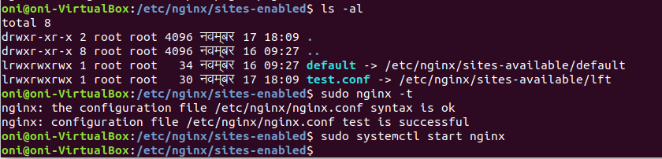

# Nginx

## Q.1.

### Step 1: Install nginx

```bash
sudo apt update
sudo apt install nginx
```

### Step 2: Host simple `index.html` using a domain named test

2.1 Create a web root folder and give the permission for others to read and execute

```bash
mkdir -p /var/www/lft/html
sudo chown $USER:$USER -R /var/www/lft/html
```

2.2 Create a simple html file named `index.html` which displays "hello nginx"

```bash
echo "<h1>hello nginx</h1>" > /var/www/lft/html/index.html
```

2.3 Also create a simple `error.html file` for troubleshooting purposes

```bash
echo "This is Error Page" > /var/www/lft/html/error.html
```

### Step 3: Create a configuration file for the domain

3.1 Create a new configuration file in the `/etc/nginx/sites-available/lft` 

Note that you can create the `test.conf` file in `sites-enabled` directory as well but as a best practice we create it in `sites-avilable` and create a symbolic link in `sites-enabled`.

The `lft` configuration file is as follows:

```bash
server {
        listen 80;
        listen [::]:80;

        root /var/www/lft/html;
        index index.html;

        server_name localhost lft www.lft;

        location / {
                try_files $uri $uri/ /error.html;
        }
}
```

3.2 Create a symbolic link of the `lft` file in the `/etc/nginx/sites-enabled` directory

```bash
sudo ln -s /etc/nginx/sites-available/lft /etc/nginx/sites-enabled/test.conf
```

### Output Screenshots:

Making the changes, testing the configuration and starting the server



Server reachable at port 80


Error page working as expected


## Q.2.

Nginx security headers are a type of http security headers that you can enable in any http server. They are not for nginx only. Almost every production grade http server supports them . 

These headers help to restrict cross site access, enforce TLS, limit resource access in the client side to name a few use cases.

  

You specify these headers in the server block.

Some of the security headers are:

1. HTTPS Strict Transport (HSTS): this is used to enforce http strictly

eg. `add_header Strict-Transport-Security 'max-age=31536000; includeSubDomains; preload';`

1. Content Security Policy: this used to limit the sources from which data can be loaded in a site, thus preventing xss like attacks.

eg. `add_header Content-Security-Policy "default-src 'self'; font-src *;script-src statis.lft.com; style-src static.lft.com";`

 3. X-XSS-Protection:  this is used to protect against cross site scripting

eg. `add_header X-XSS-Protection "1; mode=block";`

Unless these headers are mentioned in a location block they are applied globally for a domain.

Change the default config file to the following to enforce security headers:

```bash
server {
        listen 80;
        listen [::]:80;

        root /var/www/lft/html;
        index index.html;

        server_name localhost lft www.lft;

        location / {
                try_files $uri $uri/ /error.html;
        }
add_header Strict-Transport-Security 'max-age=31536000; includeSubDomains; preload';
add_header Content-Security-Policy "default-src 'self'; font-src *;script-src statis.lft.com; style-src static.lft.com";
	add_header X-XSS-Protection "1; mode=block";
}
```

### Output Screenshots:

We can see in the HTTP request and response the enforces headers


## Q.3.

### Step 1: Start your NodeJs API (running on port 7080)

```bash
	node api2.js 
```

### Step 2: Modify the exisiting `lft` config file to the following

```bash
server {
        listen 80;
        listen [::]:80;

        root /var/www/lft/html;
        index index.html;

        server_name localhost lft www.lft;

       location / {
        proxy_pass http://localhost:7080;
		}
}

```

Since we are setting up a simple POC including only `proxy_proxy` and not specifying other headers works fine for our use case.

### Output Screenshots:

API running 


Nginx Proxies to NodeJS API


## Q.4.

### Step 1: Create web root

```bash
mkdir -p /test/html
chown $USER:$USER -R /test/html/
```

### Step 2: Create default page

```bash
echo "<h1>Test is successful</h1>" > /test/html/test.html
```

### Step 3: Create  `test2.conf`

We are listening on `[localhost:82](http://localhost:82)` and the web root is pointed to `/test/` as instructed

3.1 Create a configuration file `test.conf` in the directory `/etc/nginx/sites-available/`

 

```bash
server {
        listen 82;
        listen [::]:82;

        root /test/html/;
        index test.html;

        server_name localhost lft www.lft;

      location / {
								index test.html
                try_files $uri $uri/ =402;
        }
}
```

3.2  Create a symbolic link of the `test2.conf` file in the `/etc/nginx/sites-enabled` directory

```bash
sudo ln -s /etc/nginx/sites-available/test2.conf /etc/nginx/sites-enabled/test2.conf
```

### Output Screenshots:


## Q.5.

### Step 1: Start NodeJs API 1 on port 85

Change the port to `85` in the code and start it

```bash
sudo node index.js
```

(sudo because we are listening on lower port and we need sudo permissions to be able to listen on lower ports)

### Step 2: Modify the `test2.conf` to proxy to port `85`

```bash
server {
        listen 82;
        listen [::]:82;

        root /test/html/;
        index test.html;

        server_name localhost lft www.lft;

       location / {
        proxy_pass http://localhost:85;
		}
}
```

### Output Screenshots

 

Backend Process listening on `port 85`


Server Exposing the `port 82`


## Q.6.

### Step 1: Install php

```bash
sudo apt install php-fpm
```

### Step 2: Modify default config file

Modify the default config file `/etc/nginx/sites-enabled/default` to following:

```bash
server {
    listen 80;
    server_name localhost lft www.lft;
    root /var/www/lft/html/;

    index index.html index.htm index.php;

    location / {
        try_files $uri $uri/ =404;
    }

    location ~ \.php$ {
        include snippets/fastcgi-php.conf;
        fastcgi_pass unix:/var/run/php/php7.2-fpm.sock;
     }

    location ~ /\.ht {
        deny all;
    }

}
```

### Step 3: Create `info.php` file with following content

Inside `/var/www/html/info.php`

```bash
<?php
phpinfo(); 
?>
```


### Findings

- Make sure that the fastcgi php unix socket address is correct else you will receive a bad gateway error.